# AutoTest Studio

> A desktop CAN bus test automation platform for BMS development — a Python alternative to Vector CANoe with CAPL-style scripting, live signal monitoring, fault injection, and SQLite-backed test reporting.

---

## Table of Contents

- [Overview](#overview)
- [Architecture](#architecture)
- [Layer Breakdown](#layer-breakdown)
- [GUI Panels](#gui-panels)
- [Data Flow](#data-flow)
- [CAN Bus Interfaces](#can-bus-interfaces)
- [DBC and Signal Decoding](#dbc-and-signal-decoding)
- [Test Framework](#test-framework)
- [Fault Injection](#fault-injection)
- [Database Schema](#database-schema)
- [Project State](#project-state)
- [Quick Start](#quick-start)
- [Writing Tests](#writing-tests)
- [Project Structure](#project-structure)

---

## Overview

AutoTest Studio connects to a virtual or physical CAN bus, decodes frames with a DBC file, runs automated test cases, and provides a full GUI for monitoring, sending, and fault injection. Everything persists in SQLite.

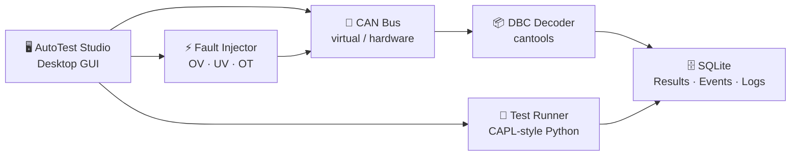

---

## Architecture

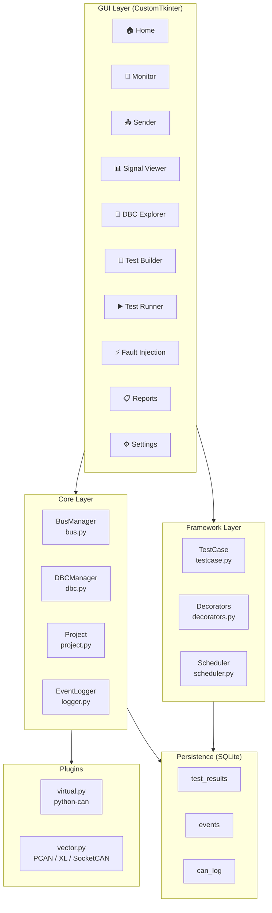

---

## Layer Breakdown

### Core Layer

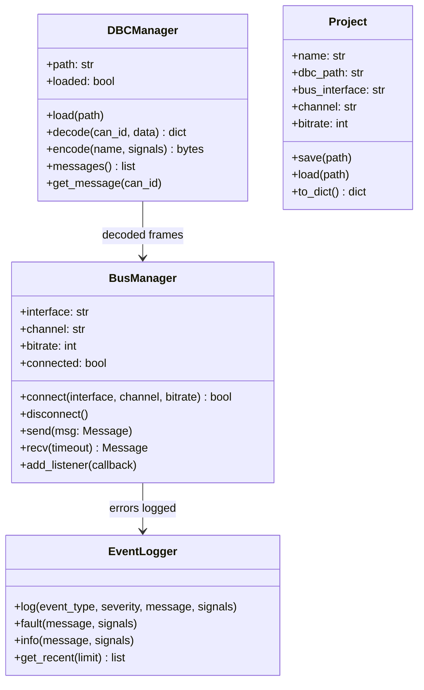

### Framework Layer

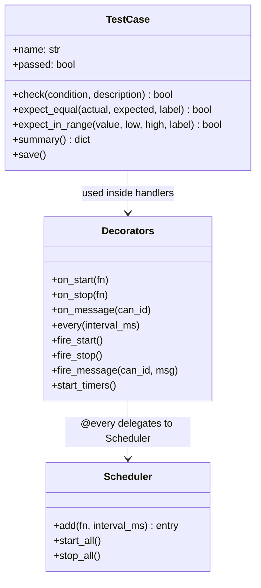

---

## GUI Panels

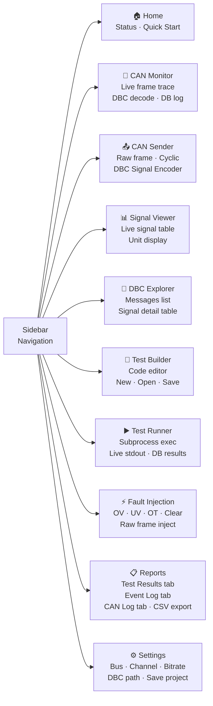

| Panel | Key Actions |
| --- | --- |
| Home | Refresh bus/DBC status, quick-start guide |
| CAN Monitor | Start/Stop receive loop, decode with DBC, persist to `can_log` |
| CAN Sender | Build raw frames, cyclic transmission, encode signals via DBC |
| Signal Viewer | Start live decode, grid of signal name → live value → unit |
| DBC Explorer | Browse all messages and signal attributes (start, length, scale, unit) |
| Test Builder | Monospace editor pre-loaded with CAPL-style template, Open/Save |
| Test Runner | Browse and `subprocess` run any `.py` test, stream stdout, show history |
| Fault Injection | One-click OV/UV/OT DBC-encoded inject, raw frame inject, inject log |
| Reports | Three-tab view of `test_results`, `events`, `can_log`; CSV export |
| Settings | Connect/disconnect bus, browse DBC, save `project.json` |

---

## Data Flow

### Live Monitoring Flow

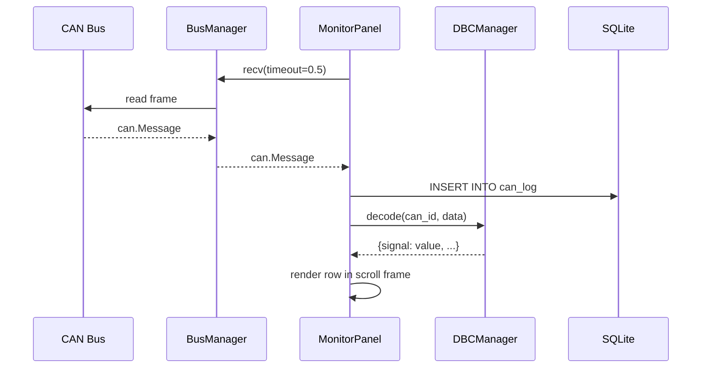

### Test Execution Flow

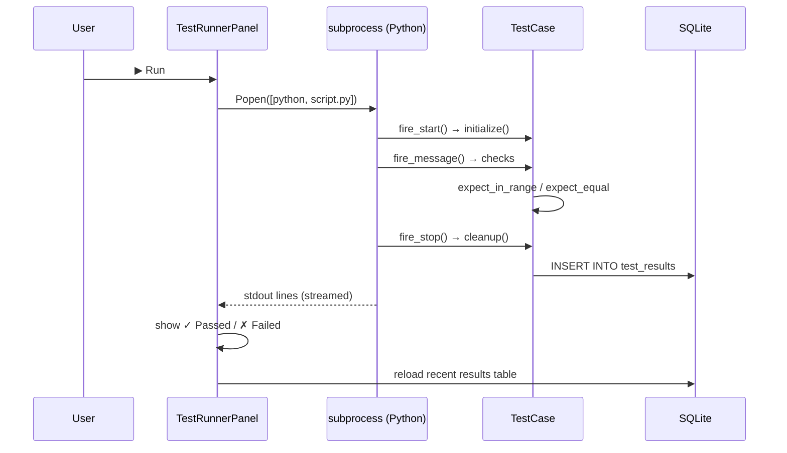

### Fault Injection Flow

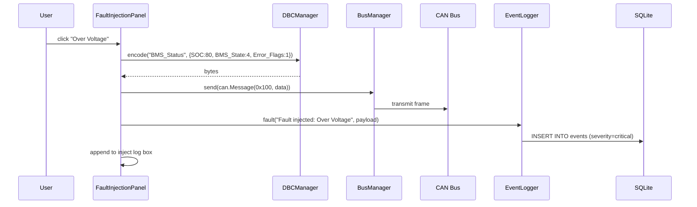

### Settings / Bus Connect Flow

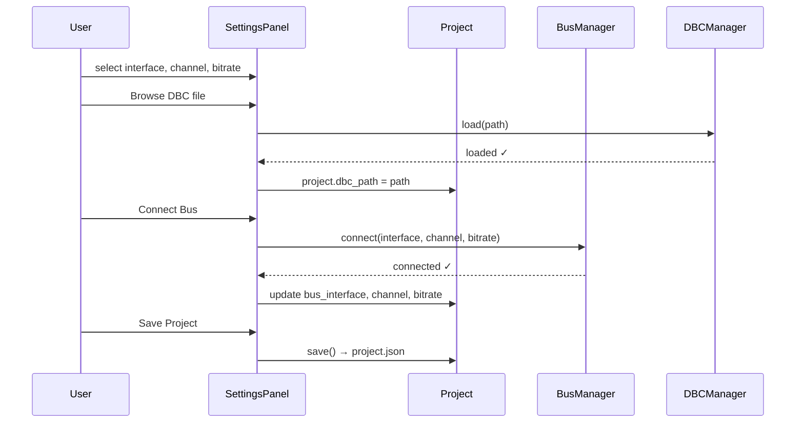

---

## CAN Bus Interfaces

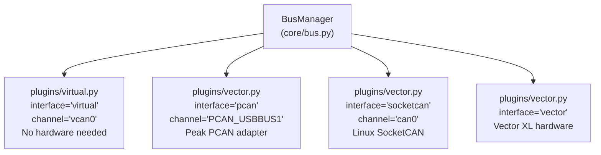

| Interface | Plugin | When to use |
| --- | --- | --- |
| `virtual` | `virtual.py` | Development, CI, no hardware |
| `pcan` | `vector.py` | Peak PCAN USB adapter |
| `socketcan` | `vector.py` | Linux native CAN (can0, vcan0) |
| `vector` | `vector.py` | Vector VN/CANcaseXL hardware |

Supported bitrates: `125000`, `250000`, `500000`, `1000000` bps.

---

## DBC and Signal Decoding

The bundled DBC is at `AutoTestStudio/assets/bms.dbc`.

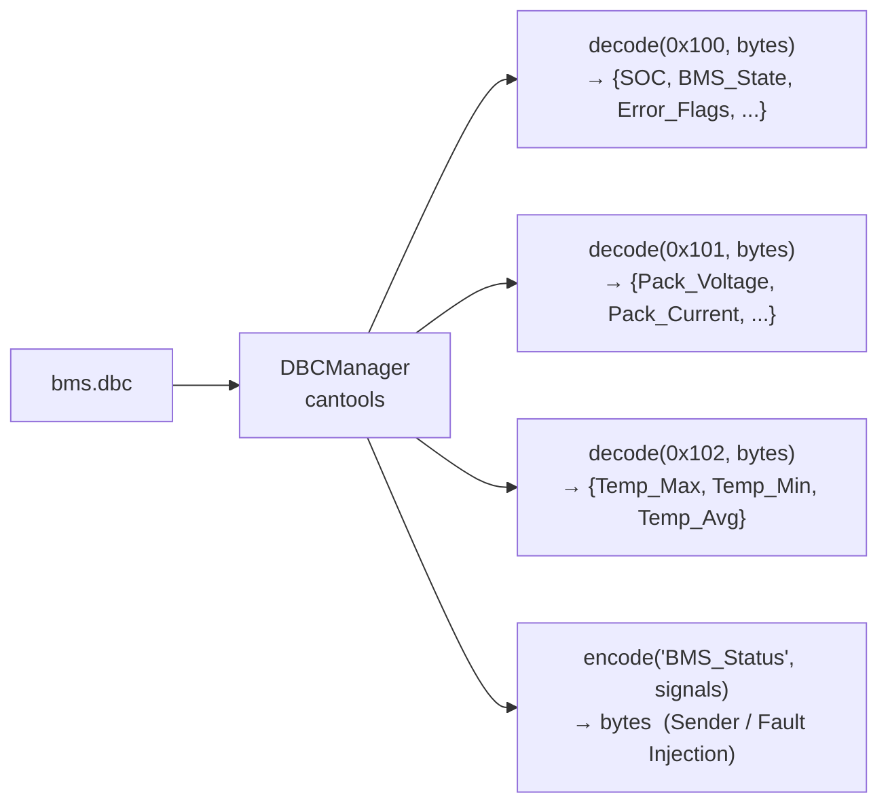

| CAN ID | Message | Signals |
| --- | --- | --- |
| `0x100` | `BMS_Status` | `SOC`, `BMS_State`, `Error_Flags`, `Counter`, `Checksum` |
| `0x101` | `BMS_PackVals` | `Pack_Voltage`, `Pack_Current`, `Cell_Voltage_Avg`, `Voltage_Dev` |
| `0x102` | `BMS_Temps` | `Temp_Max`, `Temp_Min`, `Temp_Avg` |

---

## Test Framework

### CAPL → Python mapping

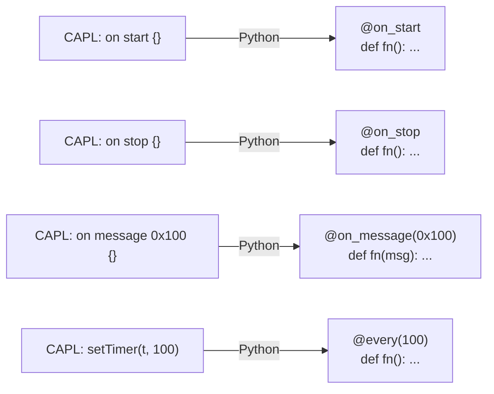

### TestCase assertion methods

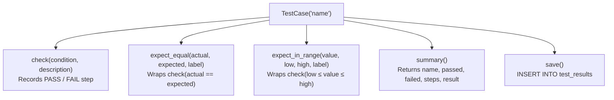

### Full test lifecycle

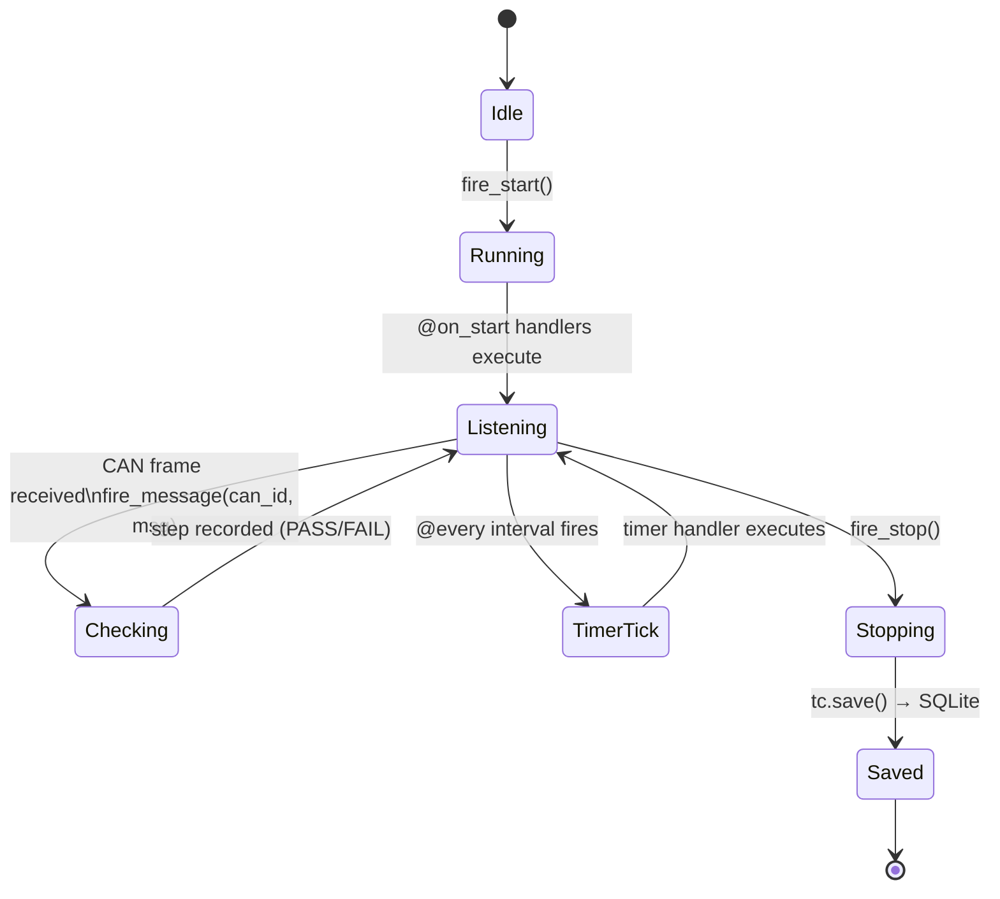

---

## Fault Injection

Preset faults are DBC-encoded and sent directly onto the bus:

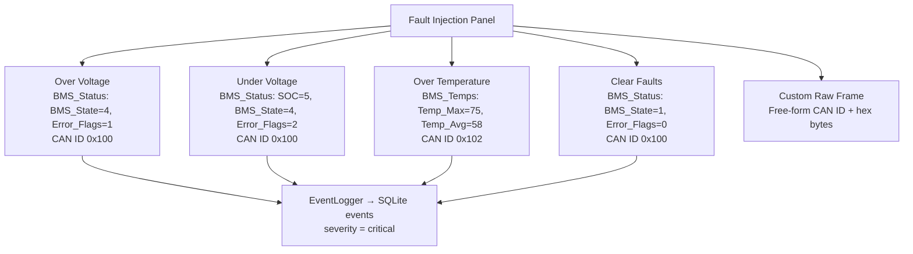

---

## Database Schema

All data is stored in `autoteststudio.db` (SQLite, created automatically on first run).

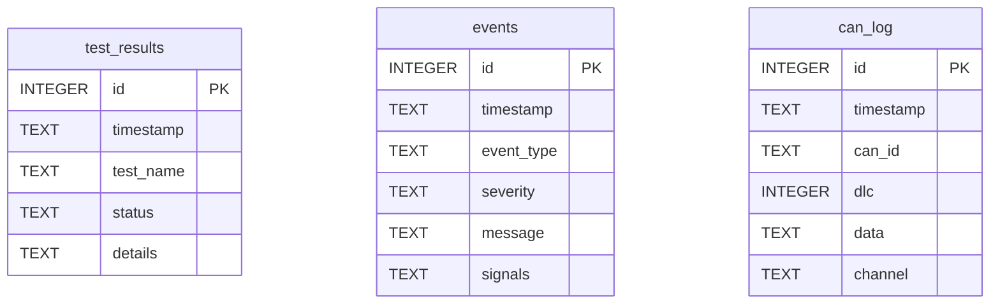

| Table | Written by | Content |
| --- | --- | --- |
| `test_results` | `TestCase.save()` | Test name, PASS/FAIL, step array (JSON) |
| `events` | `EventLogger.log()` | Event type, severity, message, signal snapshot (JSON) |
| `can_log` | `MonitorPanel` | Every received frame (hex data, CAN ID, DLC, channel) |

---

## Project State

Session configuration is saved to and loaded from `project.json` automatically on startup.

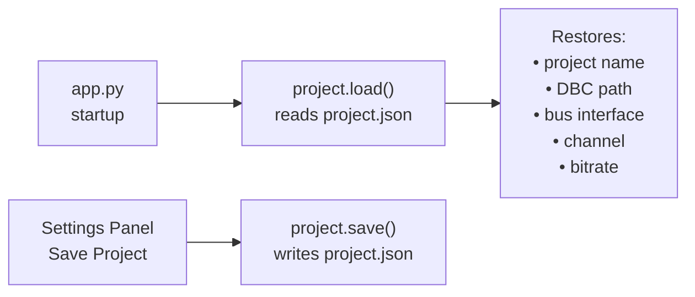

`project.json` example:

```json
{
  "name": "BMS Validation",
  "dbc_path": "AutoTestStudio/assets/bms.dbc",
  "bus_interface": "virtual",
  "channel": "vcan0",
  "bitrate": 500000
}
```

---

## Quick Start

### Prerequisites

- Python 3.10 or later
- pip

### Windows (one-click)

```bat
run_local.bat
```

### Windows (manual)

```bat
cd AutoTestStudio
python -m venv .venv
.venv\Scripts\activate
pip install -r requirements.txt
python app.py
```

### Linux / macOS

```bash
cd AutoTestStudio
python -m venv .venv
source .venv/bin/activate
pip install -r requirements.txt
python app.py
```

### First-run workflow

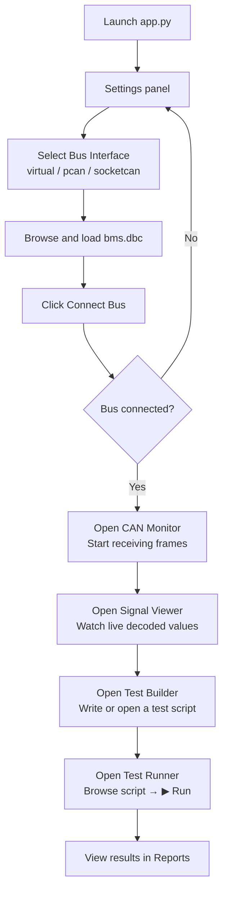

---

## Writing Tests

Tests live in `AutoTestStudio/tests/`. Every file is a standalone Python script that uses the framework decorators and `TestCase`.

```python
import sys, os
sys.path.insert(0, os.path.join(os.path.dirname(__file__), ".."))

import can
from framework.decorators import on_start, on_stop, on_message, every, fire_start, fire_stop
from framework.testcase import TestCase
from core.bus import bus_manager
from core.logger import logger

tc = TestCase("BMS_Voltage_Check")

@on_start
def setup():
    bus_manager.connect(interface="virtual", channel="vcan0")

@on_message(0x101)
def check_voltage(msg: can.Message):
    voltage = int.from_bytes(msg.data[0:2], "little") * 0.1
    tc.expect_in_range(voltage, 200, 450, "Pack Voltage")

@on_message(0x100)
def check_soc(msg: can.Message):
    soc = msg.data[0] * 0.5
    tc.expect_in_range(soc, 0, 100, "SOC")
    if soc < 20:
        logger.fault("Low SOC", {"soc": soc})

@every(100)
def heartbeat():
    msg = can.Message(arbitration_id=0x7FF, data=[0xAA], is_extended_id=False)
    bus_manager.send(msg)

@on_stop
def teardown():
    tc.save()
    bus_manager.disconnect()

if __name__ == "__main__":
    fire_start()
    # inject test frames here
    fire_stop()
    result = tc.summary()
    print(f"{result['name']} → {result['result']}")
```

Run directly from the terminal:

```bash
python AutoTestStudio/tests/example_bms.py
```

Or use the Test Runner panel to browse and execute with live output streaming.

---

## Project Structure

```text
canoe_simulator_mqi/
├── AutoTestStudio/
│   ├── assets/
│   │   └── bms.dbc               BMS CAN message definitions
│   ├── core/
│   │   ├── bus.py                BusManager — connect, send, recv
│   │   ├── dbc.py                DBCManager — load, encode, decode
│   │   ├── logger.py             EventLogger — fault/info → SQLite events
│   │   └── project.py            Project — session state → project.json
│   ├── database/
│   │   └── sqlite.py             SQLite init, schema creation, connection
│   ├── framework/
│   │   ├── decorators.py         @on_start @on_stop @on_message @every
│   │   ├── scheduler.py          Periodic task scheduler (threading.Timer)
│   │   └── testcase.py           TestCase — check, expect_equal, expect_in_range, save
│   ├── gui/
│   │   ├── main_window.py        MainWindow — sidebar + panel stack
│   │   ├── home.py               Home panel
│   │   ├── monitor.py            CAN Monitor panel
│   │   ├── sender.py             CAN Sender panel
│   │   ├── signal_viewer.py      Signal Viewer panel
│   │   ├── dbc_explorer.py       DBC Explorer panel
│   │   ├── test_builder.py       Test Builder panel (code editor)
│   │   ├── test_runner.py        Test Runner panel (subprocess + results)
│   │   ├── fault_injection.py    Fault Injection panel
│   │   ├── reports.py            Reports panel (3 tabs + CSV export)
│   │   └── settings.py           Settings panel
│   ├── plugins/
│   │   ├── virtual.py            python-can virtual interface helper
│   │   └── vector.py             PCAN / Vector XL / SocketCAN helper
│   ├── tests/
│   │   └── example_bms.py        Example BMS test script
│   ├── app.py                    Entry point — load project, init DB, launch GUI
│   ├── config.py                 App-level defaults (bus, channel, DB path, version)
│   └── requirements.txt          Python dependencies
├── run_local.bat                 Windows one-click launcher
└── README.md                     This file
```

---

## Scope

AutoTest Studio is intended for simulation, test development, training, and automation prototyping.

It is not a replacement for Vector CANoe, Vector hardware, CAPL execution, HIL validation, or safety-critical ECU verification.
